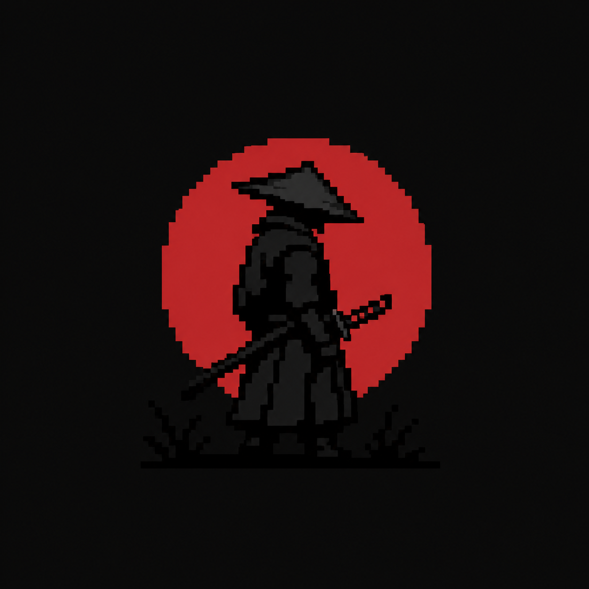
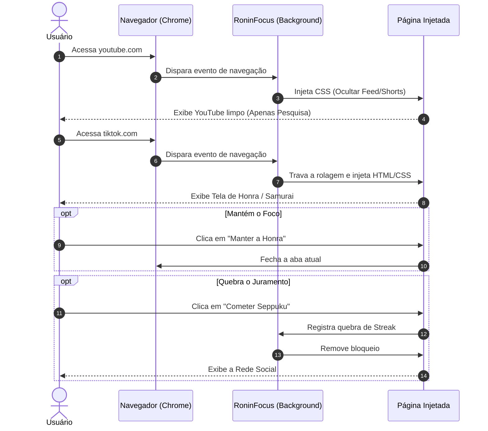

# ⛩️ RoninFocus — O Bloqueador de Distrações Implacável



> *"Cut the Noise. Protect Your Honor."*


<div align="center">
  
</div>

## 📖 Sobre o Projeto

Este projeto tem como objetivo desenvolver uma **extensão de navegador anti-procrastinação**, criada para combater o vício em rolagem infinita (doomscrolling) e vídeos curtos.

A plataforma busca transformar a disciplina e o foco em uma experiência **visceral, temática e rigorosa**, combinando a interceptação de sites com o peso e a filosofia do **Código Bushido (A Honra do Samurai)**.

---

## 🎯 Objetivo

O principal objetivo do projeto é **facilitar a entrada no estado de "Deep Work" (Trabalho Focado)**, proporcionando uma fricção psicológica que estimule a quebra de hábitos ruins e mantenha o usuário focado em seus objetivos reais.

A extensão pretende:

* 🛑 Interceptar o acesso compulsivo a redes sociais (TikTok, Instagram, etc.);
* 🧹 Ocultar gatilhos de distração em plataformas úteis (ex: YouTube Shorts e Feed);
* ⚔️ Utilizar a aversão à perda através de uma punição temática (Seppuku);
* 📈 Permitir que o usuário acompanhe seus dias de honra intacta;
* ⚡ Tornar a recusa à procrastinação uma ação inegociável.

---

## 📊 Pesquisa e Validação (Data-Driven)

Esta seção resume a análise de mercado e o feedback sobre ferramentas tradicionais de produtividade (como AppBlock e Forest).

### Pontos Negativos do Mercado Atual
- **Fáceis de burlar:** 40%+ dos usuários relatam que desligam a extensão com um clique quando a vontade de procrastinar surge.
- **Tudo ou Nada:** Bloqueiam o YouTube por completo, impedindo o usuário de pesquisar conteúdos úteis ou aulas importantes.
- **Falta de peso psicológico:** Avisos genéricos ("Você deveria estar trabalhando") não geram a fricção necessária.

### Pontos Positivos da Abordagem Samurai
- Apelo direto ao público que busca "disciplina hardcore".
- Limpeza seletiva do YouTube (mantém a barra de pesquisa, mata o algoritmo).
- O gatilho de "Honra" e o sacrifício do Samurai geram forte retenção por aversão à perda.

---

## ⚙️ Funcionalidades Principais

### 1. Interceptação Total e Bloqueio
* **Redes Sociais:** Bloqueio imediato de domínios viciantes (TikTok, Instagram, Twitter/X).
* **Tela de Desonra:** Substituição do conteúdo da página por uma interface imersiva alertando sobre a quebra do juramento de foco.

### 2. Filtro Cirúrgico (YouTube Cleaner)
* **Omissão do Feed:** A página inicial do YouTube é esvaziada, removendo a "grade de recomendações" do algoritmo.
* **Extermínio de Shorts:** Remoção via CSS de qualquer aba, botão ou prateleira referente ao YouTube Shorts.

### 3. Mecânica de Atrito (A Escolha)
* **Manter a Honra:** Botão em destaque que fecha a aba instantaneamente, retornando o usuário ao trabalho.
* **Cometer Seppuku:** Botão com menor apelo visual. Se clicado, o Samurai virtual é sacrificado, a honra é zerada, e o site é liberado.

---

## 🗺️ Diagramas de Sequência e Caso de Uso



---

## 🎨 Diretrizes de UI/UX e Gamificação

* **Paleta de Cores "Bushido":** Contraste intenso entre fundo Preto Profundo, detalhes em Cinza Grafite e elementos de alerta em Vermelho Sangue (`#dc2626`).
* **Tipografia Rígida:** Uso de fontes *monospace* (Courier) para simular decretos imperativos.
* **Atrito Psicológico:** O design não apenas alerta, ele julga. O botão de acessar a rede social é desestilizado para desencorajar o clique.
* **Omissão Positiva:** A limpeza visual do YouTube remove a fadiga de decisão. A tela em branco força a pesquisa intencional.

---

## 💻 O Coração do MVP (Código Base)

O MVP foi construído com foco em leveza e performance, utilizando apenas **Vanilla JS** e o **Manifest V3**.

### Estrutura de Diretórios

```text
/
 ├── /RoninFocus
 │    ├── bloqueador.js       # Lógica principal de injeção e bloqueio
 │    ├── icon.png            # Ícone usado pela extensão
 │    ├── manifest.json       # Configuração, Permissões e Popups
 │    ├── popup.html          # Interface visual da janela popup
 │    └── popup.js            # Lógica de alternância (Ligar/Desligar)
 ├── /src
 │    ├── icon.png            # Ícone para o README
 │    └── miyamoto.gif        # GIF do Miyamoto Musashi para o README
 └── README.md                # Este documento de documentação

```

### 1. O Manifesto (`manifest.json`)

O arquivo que garante as permissões necessárias e conecta o popup e os ícones à extensão.

```json
{
  "manifest_version": 3,
  "name": "RoninFocus",
  "version": "1.2",
  "description": "Cut the Noise. Protect Your Honor. Bloqueador de vídeos curtos.",
  "permissions": [
    "storage"
  ],
  "icons": {
    "16": "src/icon.png",
    "48": "src/icon.png",
    "128": "src/icon.png"
  },
  "action": {
    "default_popup": "popup.html",
    "default_icon": "src/icon.png"
  },
  "content_scripts": [
    {
      "matches": [
        "*://*[.tiktok.com/](https://.tiktok.com/)*", 
        "*://*[.instagram.com/](https://.instagram.com/)*", 
        "*://*[.youtube.com/](https://.youtube.com/)*",
        "*://*[.twitter.com/](https://.twitter.com/)*",
        "*://*[.x.com/](https://.x.com/)*"
      ],
      "js": ["bloqueador.js"]
    }
  ]
}

```

### 2. A Janela do Popup (`popup.html` e `popup.js`)

Interface enxuta para alternar o estado do bloqueador em tempo real.

**`popup.html`**

```html
<!DOCTYPE html>
<html lang="pt-BR">
<head>
    <meta charset="UTF-8">
    <style>
        body { 
            width: 200px; 
            background: #0a0a0a; 
            text-align: center; 
            padding: 20px; 
            font-family: Arial, sans-serif; 
            margin: 0; 
        }
        .logo-popup {
            width: 60px;
            height: 60px;
            margin-bottom: 10px;
            border-radius: 8px;
        }
        h2 { 
            margin-top: 0; 
            color: #dc2626; 
            text-transform: uppercase; 
            font-size: 18px; 
        }
        button { 
            width: 100%; 
            padding: 15px; 
            font-size: 14px; 
            font-weight: bold; 
            cursor: pointer; 
            border: none; 
            border-radius: 5px; 
            color: white; 
            margin-top: 10px;
        }
        .botao-ligado { background-color: #555555; }
        .botao-desligado { background-color: #dc2626; }
    </style>
</head>
<body>
    
    <h2>RoninFocus</h2>
    <button id="toggleBtn">...</button>
    <script src="popup.js"></script>
</body>
</html>

```

**`popup.js`**

```javascript
const toggleBtn = document.getElementById('toggleBtn');

chrome.storage.local.get(['focoAtivo'], (result) => {
    let ativo = result.focoAtivo !== false;
    atualizarBotao(ativo);
});

toggleBtn.addEventListener('click', () => {
    chrome.storage.local.get(['focoAtivo'], (result) => {
        let novoStatus = result.focoAtivo === false ? true : false;
        
        chrome.storage.local.set({ focoAtivo: novoStatus }, () => {
            atualizarBotao(novoStatus);
        });
    });
});

function atualizarBotao(ativo) {
    if (ativo) {
        toggleBtn.innerText = "DESLIGAR FOCO";
        toggleBtn.className = "botao-ligado";
    } else {
        toggleBtn.innerText = "LIGAR FOCO";
        toggleBtn.className = "botao-desligado";
    }
}

```

### 3. A Lógica de Interceptação (`bloqueador.js`)

O script que avalia a memória local (`chrome.storage`), limpa o YouTube e bloqueia redes sociais com redirecionamento de segurança.

```javascript
chrome.storage.local.get(['focoAtivo'], function(result) {
    if (result.focoAtivo === false) return;

    const urlAtual = window.location.href;

    // 1. YouTube Cleaner (Limpeza cirúrgica)
    if (urlAtual.includes("youtube.com")) {
        if (urlAtual.includes("/shorts/")) {
            mostrarTelaSamurai();
        } else {
            const estiloYouTube = document.createElement('style');
            estiloYouTube.innerHTML = `
                ytd-browse[page-subtype="home"] ytd-rich-grid-renderer { display: none !important; }
                ytd-reel-shelf-renderer { display: none !important; }
                a[title="Shorts"], ytd-mini-guide-entry-renderer[aria-label="Shorts"] { display: none !important; }
            `;
            document.head.appendChild(estiloYouTube);
        }
    } 
    // 2. Bloqueio Total (Redes Sociais)
    else if (urlAtual.match(/tiktok\.com|instagram\.com|twitter\.com|x\.com/)) {
        mostrarTelaSamurai();
    }

    // 3. A Tela de Desonra (Fricção Visual)
    function mostrarTelaSamurai() {
        document.body.style.overflow = "hidden";
        
        document.body.innerHTML = `
            <div style="display: flex; flex-direction: column; align-items: center; justify-content: center; height: 100vh; background-color: #0a0a0a; color: #fff; font-family: 'Courier New', Courier, monospace; text-align: center; z-index: 999999; position: fixed; top: 0; left: 0; width: 100%;">
                <h1 style="color: #dc2626; font-size: 3.5rem; text-transform: uppercase;">A Honra foi Quebrada</h1>
                <p style="font-size: 1.5rem; max-width: 600px; color: #cccccc;">
                    Você fez um juramento de foco. Continuar forçará seu Samurai a cometer <b>Seppuku</b>.
                </p>
                <div style="font-size: 6rem; margin: 30px 0;">🗡️🩸🥋</div>
                
                <button id="btnHonra" style="background-color: #dc2626; color: white; border: none; padding: 15px 40px; font-size: 1.2rem; cursor: pointer; font-weight: bold; text-transform: uppercase; margin-top: 20px; border-radius: 5px;">
                    Manter a Honra (Sair do Site)
                </button>
                
                <button id="btnDesonra" style="background-color: transparent; color: #555; border: 1px solid #555; padding: 10px 20px; font-size: 1rem; cursor: pointer; margin-top: 20px; border-radius: 5px;">
                    Cometer Seppuku e Acessar
                </button>
            </div>
        `;

        document.getElementById('btnHonra').addEventListener('click', function() {
            window.location.href = "[https://www.google.com](https://www.google.com)";
        });

        document.getElementById('btnDesonra').addEventListener('click', function() {
            document.body.innerHTML = `
                <div style="display: flex; align-items: center; justify-content: center; height: 100vh; background-color: #450a0a; color: white; font-family: 'Courier New', Courier, monospace;">
                    <h1 style="font-size: 2rem;">Honra: 0. O sacrifício foi feito. Atualize a página para acessar a distração.</h1>
                </div>
            `;
        });
    }
});

```

---

## 🛠️ Tecnologias e Infraestrutura

* **JavaScript Vanilla:** Foco absoluto em performance para interceptar sites antes da renderização.
* **Manifest V3:** Padrão arquitetural mais recente, garantindo segurança e baixo consumo de memória (usando Service Workers em vez de scripts contínuos).

---

## 🏗️ Engenharia de Software

O projeto adota metodologias para lidar com o dinamismo do DOM de sites externos:

* **Modelo Espiral:** Desenvolvimento focado na análise de riscos. A cada ciclo validamos a compatibilidade com a Chrome API antes de expandir o design.
* **Kanban:** Gerenciamento visual do fluxo de trabalho (To Do, In Progress, Done).
* **Lean Startup:** O MVP é enxuto, testando primeiro a eficácia psicológica do atrito antes de criar infraestruturas complexas de banco de dados.

---

## 🗓️ Roadmap do MVP

* [x] **Milestone 1: Forja da Lâmina (Base do Projeto)**
* Criação do `manifest.json`, setup da estrutura e lógica inicial de bloqueio bruto.
* [x] **Milestone 2: Filtros e Cirurgias Web**
* Implementação da injeção de CSS customizado no YouTube (ocultar Feed Inicial e Shorts).
* [x] **Milestone 3: O Dojo Visual (Interface e Arte)**
* Adição da "Tela de Desonra" injetável, Popup interativo, ícones e sistema de Redirecionamento de Segurança.
* [ ] **Milestone 4: Memória e Gamificação**
* Evolução da Chrome Storage API para contar a Ofensiva (Streak) de dias focado e penalizações de honra.
* [ ] **Milestone 5: Polimento e Lançamento**
* Criação da Landing Page de apresentação e submissão para a Chrome Web Store.

---

## 🏯 Como Instalar e Testar Localmente

Siga o passo a passo abaixo para rodar o MVP no seu navegador:

1. Clone este repositório no seu computador (ou baixe a pasta contendo os arquivos):

```bash
git clone [https://github.com/1Soryuu/RoninFocus.git](https://github.com/1Soryuu/RoninFocus.git)

```

2. Abra o Google Chrome e digite na barra de endereços: `chrome://extensions/`
3. No canto superior direito da tela, ative a chave **"Modo do desenvolvedor"**.
4. Clique no botão **"Carregar sem compactação"** (*Load unpacked*) que aparecerá no canto superior esquerdo.
5. Selecione a pasta `RoninFocus` (onde estão o `manifest.json` e o `bloqueador.js`).
6. **Pronto!** A extensão está ativa. Tente acessar o YouTube ou o TikTok para testar a sua honra!
